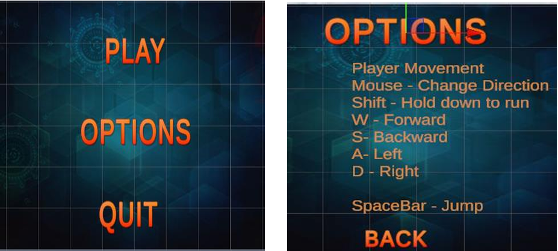
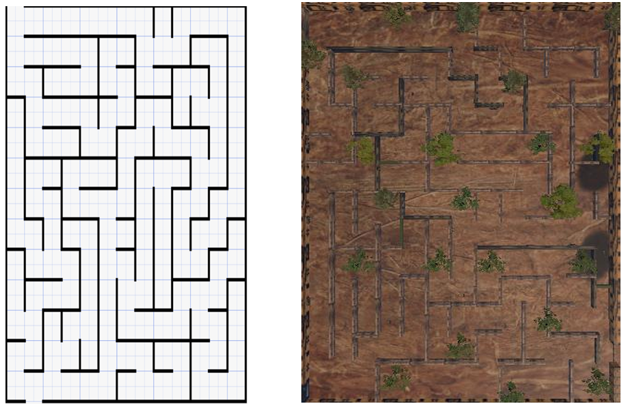

# Interactive Visualization Assignment - Aztec Island VR Environment

 ### [YouTube Demonstration](https://www.youtube.com/watch?v=CQvEaY2AXjE&t=125s)

<h2>Description</h2>
This project involves creating an immersive virtual reality environment called "Aztec Island" using Unity. The 3D world is an educational experience that teaches users about Aztec civilization through interactive exploration, maze navigation, and puzzle-solving. Players collect rings, avoid obstacles, and learn about Aztec history while navigating through three distinct scenes.
 

<h2>Technologies and Tools Used</h2>

- <b>Unity 2022.3.8f1</b> (Game Engine)
- <b>C#</b> (Programming Language)
- <b>Visual Studio</b> (IDE)
- <b>Unity UI & Text Mesh Pro</b> (User Interface)

<h2>Environments Used</h2>

- <b>Unity 2022.3.8f1</b>
- <b>Windows 10/11</b>
- <b>VR Headsets</b> (Compatible)
- <b>Desktop PCs</b> (Primary Development)

<h2>Project Features and Implementation</h2>

 
Game Menu Interface:  
 <!-- Replace with your actual image -->
 
 

Maze Design and Construction:   
 <!-- Replace with your actual image -->
 
 

<h2>Key Features</h2>

- <b>Three Interactive Scenes</b>: Menu, Prologue, and Main Game Environment
- <b>Advanced Collision Detection</b>: Box, Sphere, and Mesh colliders for realistic interactions
- <b>Trigger System</b>: OnTriggerEnter/Exit events for dynamic interactions
- <b>Inventory System</b>: Custom ring collection and tracking
- <b>Animated Obstacles</b>: Moving walls and interactive elements
- <b>Educational Content</b>: Aztec history and cultural information

<h2>Control Scheme</h2>

| Key | Function |
|-----|----------|
| W/Up Arrow | Move Forward |
| S/Down Arrow | Move Backward |
| A/Left Arrow | Move Left |
| D/Right Arrow | Move Right |
| Spacebar | Jump |
| Shift | Run |
| Mouse | Look Around |

<h2>Collision System Implementation</h2>

- <b>Doors</b>: Box colliders with trigger events for automatic opening/closing
- <b>Aztec Rings</b>: Sphere colliders for collection triggers
- <b>Maze Walls</b>: Box colliders for physical barriers
- <b>Complex Objects</b>: Mesh colliders for detailed geometric shapes

<h2>Scene Structure</h2>

1. <b>Scene 1 - Menu</b>: Interactive menu with Play, Options, and Quit buttons
2. <b>Scene 2 - Prologue</b>: Story introduction using Timeline and Canvas
3. <b>Scene 3 - Game Environment</b>: Main Aztec Island with maze, rings, and interactive elements

<h2>Educational Value</h2>

- Teaches about Aztec civilization and culture
- Develops problem-solving skills through maze navigation
- Enhances spatial awareness and strategic thinking
- Provides immersive historical learning experience

<h2>Research Components</h2>

The project includes comprehensive research on:
- Virtual Reality applications in education
- Comparison of VR presentation methods (Desktop, HMD, CAVE)
- Experimental design for evaluating educational effectiveness
- User experience assessment methodologies

<h2>Skills Demonstrated</h2>

- 3D environment design and development
- C# programming for game mechanics
- Collision detection and trigger systems
- User interface design
- Educational technology implementation
- Research methodology in VR applications

 
 
